## INSTALAR COMPOSER INSTALL

## php artisan key:migrate
    - Gererar la clave para que funcione el proyect y luego en render.

    - PP_KEY=base64:yKH6S+KKgEtFz55dCoZ9gfY7kXDtuEhKcqe4XVvm32E=

## DOCKER-COMPOSE.LOCAL.YML

    - Implementacion de un contenedor de una base de datos en postgres
  
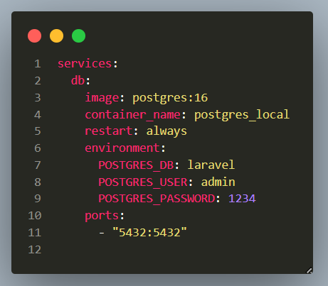

    - prueba del enpoint (/pizza).
  
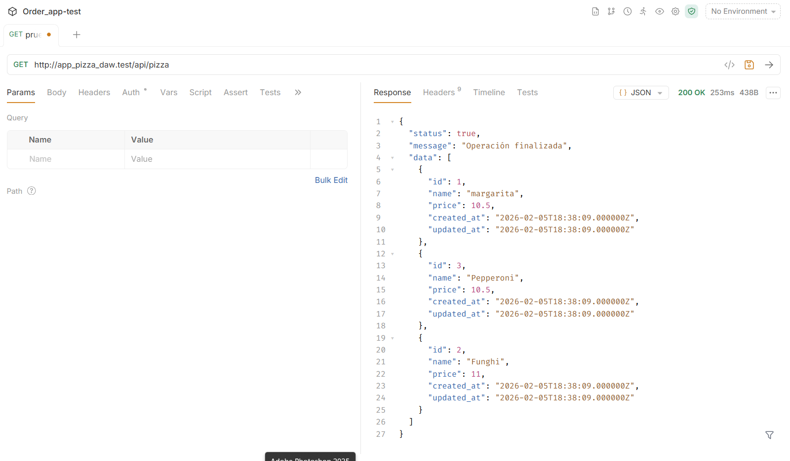

    - prueba del enpoint (/find/1).
  
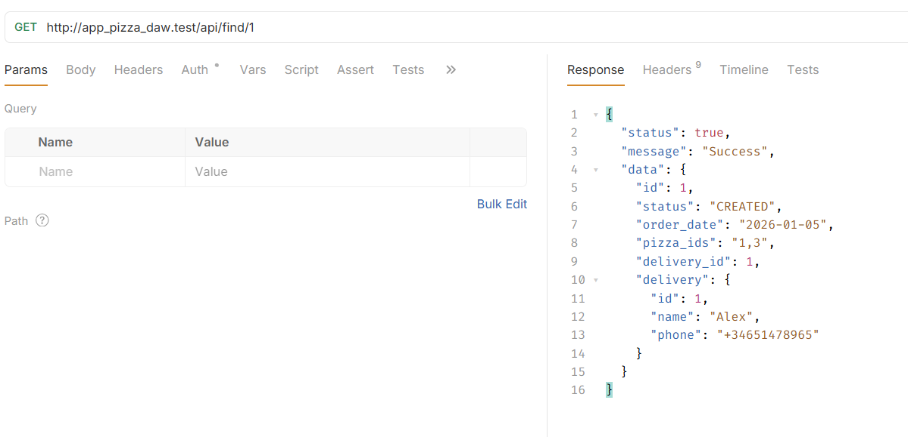

## DOCKER-COMPOSE.DEV.YML

### Implementacion de un contenedor de una base de datos en postgres y otro para que carge el laravel y dockerfile para cargar los seeder.

    - docker-compose.dev.yml
  
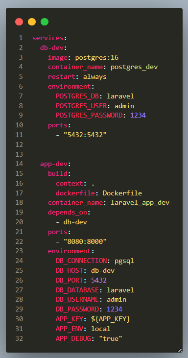

    - .dockerignore

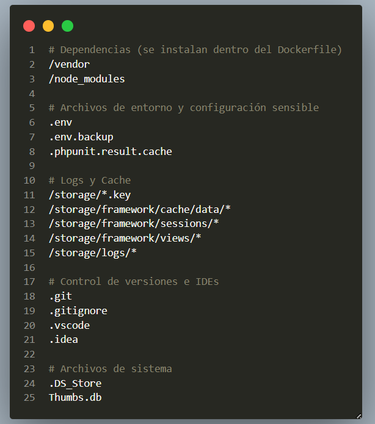

    - Dockerfile

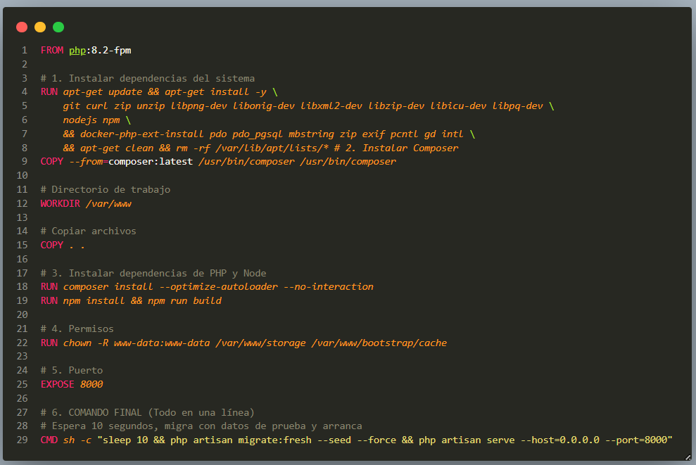

Aqui tenemos dos contenedores uno es el de la base de datos postgres y el otro es para que levante laravel y los seeder

lo que hace el dockerfile el cuando se despliegue hace el composer install y levanta se espera 10 segundos y hace los seeder y levanta el proyecto.

La clave es el .dockerignore que lo que hace es que le decimos al contenedor que ignore el .env y asi pueda coger las variables de entorno que hemos puesto en el contenedor db-dev las "environment"

que apunta al contenedor de la base de datos que hemos puesto arriba, el db-dev.

    - prueba del enpoint (/pizza) en el dev 

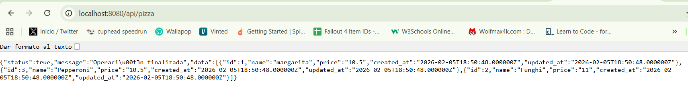

## DESPLIGUE EN RENDER CON POSTGRES

    - web service para la pagina.
    - postgres

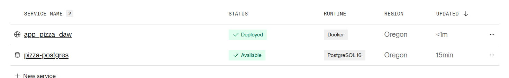

    - variables de entorno que apuntan a la base de datos postgres creada en render.

    - prueba de despliegue de la aplicacion.

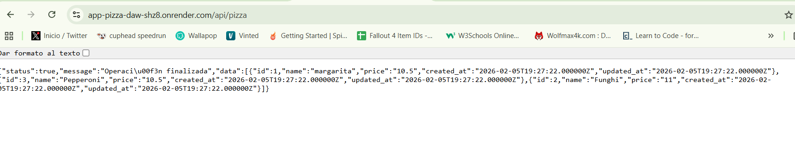

    - Dockerfile

    - Lo que hacees que el docker compose esta configurado para cargar los migrate y todo, preparado para render y el docker compose dev se que tu utilizaste los una imagen pero asi me funciona tamben.

 - ENLACE DE RENDER https://app-pizza-daw-shz8.onrender.com/

## RENDER MYSQL

    - variables de entorno de mysql

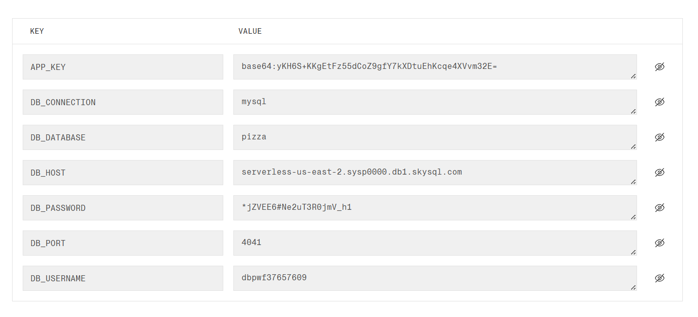

    - lo cree una base de datos en skysql y me meti a la base de datos desde la extension y cree una base de datos llamada pizza la cosa que cuando intenta desplegar da error no se realmente es la contraseña o no , que sepas que me voy cabreado jaja.

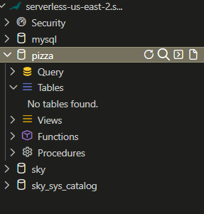